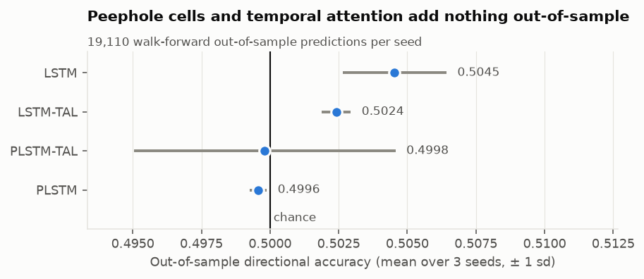
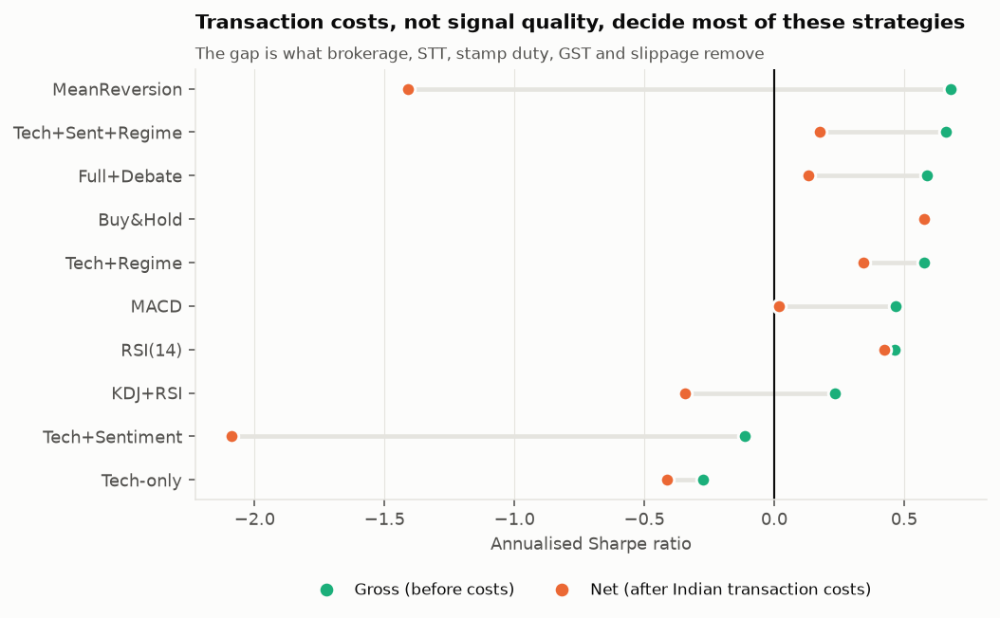
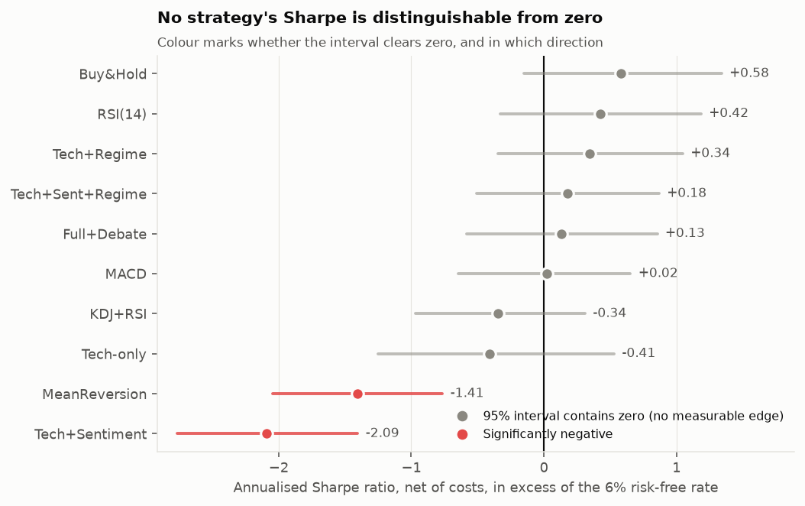
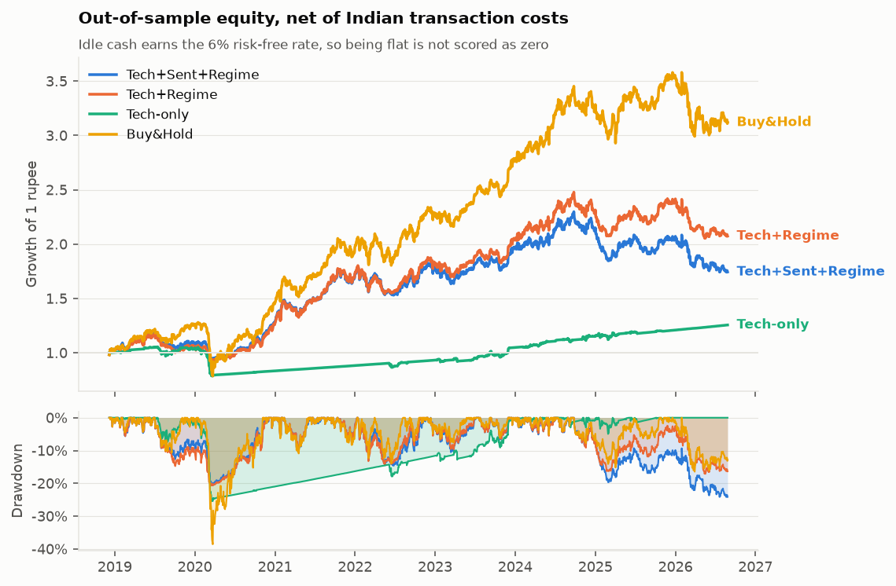
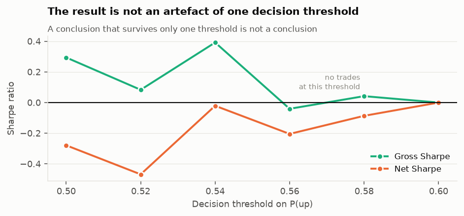
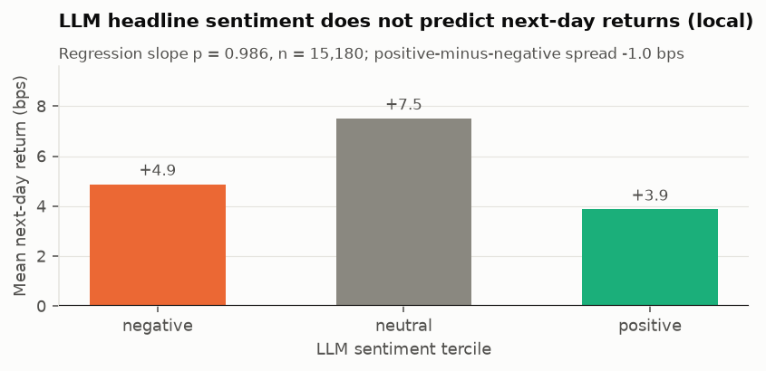
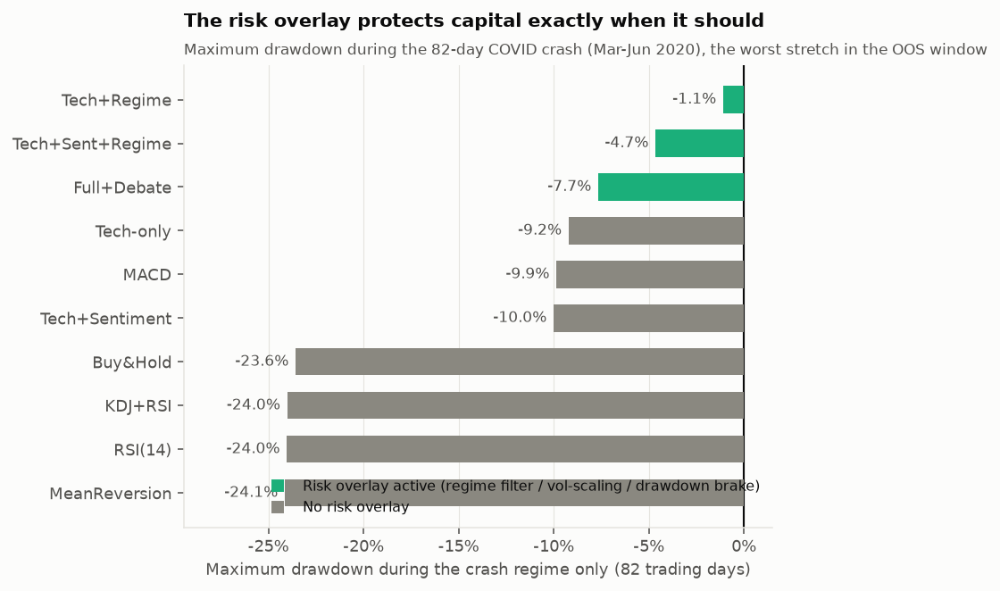
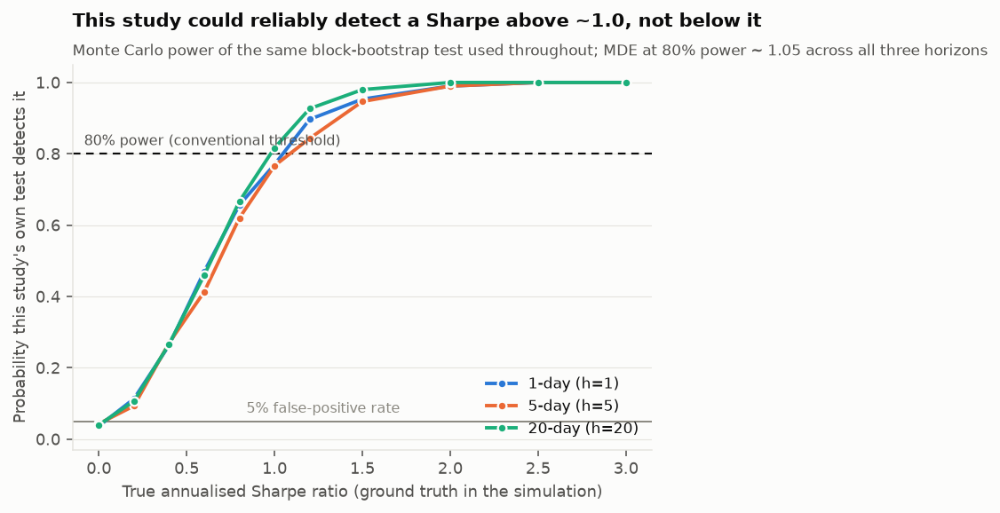
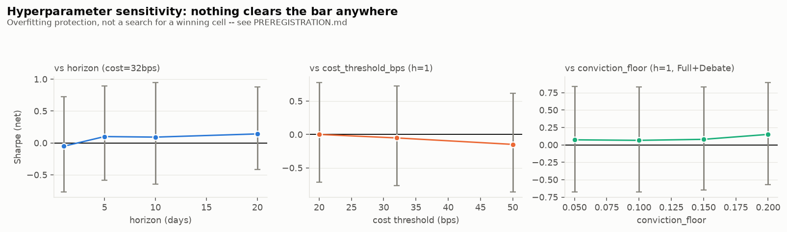

# A Multi-Agent LLM Framework for Explainable Algorithmic Trading on NSE-Listed Equities

An attention-augmented deep learning forecaster, an LLM news-sentiment analyst, and a
structured bull/bear debate, combined into one auditable trading decision — and then
evaluated honestly enough to say that **none of it beats buying and holding.**

That negative result is the contribution. The machinery below exists to make it
*trustworthy*: purged walk-forward validation, a full Indian transaction-cost model,
open-to-open execution, block-bootstrap confidence intervals, Holm correction, and a
Deflated Sharpe Ratio that charges the result for every configuration searched.

---

## Contents

- [The claim, and what actually happened](#the-claim-and-what-actually-happened)
- [Results](#results)
- [Does the null hold across market regimes?](#does-the-null-hold-across-market-regimes)
- [Synthetic stress tests](#synthetic-stress-tests-does-the-regime-overlay-de-risk-before-a-real-crash-happens)
- [Risk attribution and extended benchmarks](#risk-attribution-and-extended-benchmarks)
- [Hyperparameter sensitivity](#hyperparameter-sensitivity-is-the-null-fragile-to-any-single-choice)
- [How to reproduce](#how-to-reproduce)
- [Live pipeline: the same agents, running on real data today](#live-pipeline-the-same-agents-running-on-real-data-today)
- [Architecture](#architecture)
- [How correctness is verified](#how-correctness-is-verified)
- [Threats to validity](#threats-to-validity)
- [Relation to the literature](#relation-to-the-literature)
- [What I would do next](#what-i-would-do-next)

---

## The claim, and what actually happened

The literature this project builds on reports, in sequence:

1. **PLSTM-TAL** (Heliyon 2024) — a peephole LSTM with temporal attention beats CNN,
   LSTM, SVM and Random Forest at index direction prediction.
2. **Lopez-Lira & Tang** (2023, rev. 2025) — GPT-4 scoring of news headlines predicts
   subsequent returns; small models (GPT-1/2, BERT) cannot do it.
3. **TradingAgents** (arXiv 2412.20138) — LLM agents in specialist roles, with bull/bear
   researchers debating and a risk team overseeing, beat Buy-and-Hold, MACD and KDJ+RSI
   on cumulative return and Sharpe.

This project reimplements all three ideas on **NSE-listed Indian equities**, which the
agentic-trading literature has barely touched, and evaluates them under one shared,
deliberately unforgiving protocol.

**What happened:**

| Claim under test | Result here |
|---|---|
| Peephole cells + temporal attention improve direction prediction | **Not supported.** All four architectures land at 49.96%–50.45% out-of-sample accuracy. The plain LSTM scores highest. No architecture differs from chance (best p = 0.21). |
| Attention-augmented DL beats classical baselines on P&L | **Not supported.** Every learned model loses to Buy&Hold, most of them significantly after Holm correction. |
| A multi-agent system beats Buy-and-Hold | **Not supported** on this data. The best configuration reaches Sharpe 0.34 against Buy&Hold's 0.58. |
| LLM headline sentiment predicts next-day returns | **Not supported at 1.5B.** Event study over 15,200 symbol-days: slope p = 0.986, and the tercile ordering is inverted. A direct replication of the paper's own *small-model* result. |
| Adding agents to a system improves it | **False here.** Adding the sentiment agent is actively harmful — `Tech+Sentiment` is the worst strategy in the study (Sharpe −2.09, 123.9× turnover). Only the regime filter helps, and not enough. |
| Costs are a detail | **Emphatically false.** The mean-reversion baseline has a *gross* Sharpe of **+0.68** and a *net* Sharpe of **−1.41**. Its 223×/year turnover costs 36% of capital annually. |
| Trying harder (more model classes, horizons, universe breadth) would find an edge | **Tested directly — no.** Nine further pre-registered attempts (GBM, wider universe, cross-sectional labels, longer horizons, debiasing) all failed; one briefly looked real before a units bug in the CI was caught and fixed. |
| The null result means there is no edge at all | **Not quite — now quantified.** A power analysis shows this study could only reliably detect a true Sharpe above **~1.0**. The honest claim is "no edge that large was found," not "no edge exists." |
| The risk overlay does nothing since it doesn't beat Buy&Hold | **Wrong mechanism, not no mechanism.** During the 82-day COVID crash it captured a −1.1% drawdown against Buy&Hold's −23.6%. It trades upside for downside protection, and over this window that trade lost on net — a different finding from "no effect." |

The last row is the single most transferable finding. On daily NSE signals, the
round-trip cost floor is **32 bps** (0.1% STT each way, 0.015% stamp duty on the buy,
exchange and SEBI charges, 18% GST on those, and 5 bps of slippage). A strategy needs
to be right by more than that before it is right at all.

---

## Results

Out-of-sample window: **2018-12-07 → 2026-08-27** (1,911 trading days, 19,110
symbol-days), across 10 liquid NSE large/mid caps. Every strategy — learned, classical,
and agentic — is run through the identical execution path, cost model and date range.

### Directional accuracy: the architecture ablation



| Architecture | Accuracy (3 seeds) | AUC | MCC | p vs chance |
|---|---|---|---|---|
| LSTM (plain) | 0.5045 ± 0.0019 | 0.5049 | 0.0076 | 0.21 |
| LSTM-TAL (attention only) | 0.5024 ± 0.0005 | 0.5017 | 0.0056 | 0.51 |
| PLSTM-TAL (the paper's model) | 0.4998 ± 0.0048 | 0.5008 | 0.0007 | 0.96 |
| PLSTM (peephole only) | 0.4996 ± 0.0003 | 0.4999 | −0.0018 | 0.90 |

The between-architecture spread (0.005) is the same size as the between-seed spread,
which is the finding: at this effect size, a single-seed architecture comparison
measures initialisation luck. **This is why the ablation runs 3 seeds and reports the
spread** — the papers being replicated generally do not.

### Cost-adjusted performance



The gap between the two dots is what Indian transaction costs remove. Note
`MeanReversion`: a genuinely positive gross signal that is deeply unprofitable to trade.

### Is any of it distinguishable from zero?



**No.** Buy&Hold's 0.58 Sharpe has a 95% block-bootstrap interval of [−0.15, +1.34] —
7.7 years is not enough data to establish even a passive equity premium at conventional
significance. Reporting a point estimate without this interval is how backtests get
oversold.

The **Deflated Sharpe Ratio** makes it worse, correctly. Given the 10 configurations
searched in the full agent ablation, the expected maximum Sharpe from pure noise alone is
**1.35** — higher than Buy&Hold's own 0.58, let alone anything the learned strategies
produced. Under that null, no strategy in this study clears the bar. (This number rises
further once the nine additional improvement attempts below are counted; see
[`PREREGISTRATION.md`](PREREGISTRATION.md).)

### Equity curves



`Tech-only` is flat 84% of the time (it trades only on high-confidence days) and
therefore mostly earns the risk-free rate — which the backtest credits, so that being
selective is not artificially punished.

### Threshold sensitivity



A result that only appears at one hand-picked decision threshold is an artefact. This
one does not appear at *any* threshold, which is at least consistent.

### Does LLM headline sentiment predict returns?

Tested as a **standalone event study before any strategy is built on it**, because a
sentiment signal with no return predictability cannot acquire it by being placed inside
a multi-agent system.

Corpus: 34,992 headlines (after noise filtering) scored by Qwen2.5-1.5B-Instruct,
aggregated to **15,200 (symbol, trading-day) views**.



| Test | Result |
|---|---|
| OLS slope, next-day return on sentiment | **+0.05 bps** per unit sentiment (se 3.04), t = 0.018, **p = 0.986**, R² = 0.0000 |
| Positive-minus-negative tercile spread | **−1.01 bps/day**, t = −0.28, **p = 0.782** — the *wrong sign* |
| Mean next-day return, all views | +5.42 bps |

**No predictability, and the tercile ordering is inverted.** This is a direct
replication of Lopez-Lira & Tang's *negative* result — they report that GPT-1, GPT-2 and
BERT fail at this task and that predictability emerges only in more capable models.
Qwen2.5-1.5B behaves exactly like their small-model group.

The label distribution shows why, and is worth reporting on its own:

| P(Good) | P(Bad) | P(Unknown) | Mean signed score |
|---|---|---|---|
| 0.458 | 0.154 | 0.388 | **+0.303** |

A **3:1 bullish skew**. On a long-only book that is a systematic bias, not noise — the
model is largely reporting its own prior rather than reading the headline. The `Unknown`
escape absorbs 39% of the mass, which is the design working; the residual skew is not.

**This is the single result most likely to change with a better model**, and it is a
one-flag swap (`--backend anthropic`).

---

### The multi-agent ablation

Each configuration adds exactly one component, so the contribution of each is
separately visible. All run the identical execution path and cost model, and the
`Full+Debate` row includes the bull/bear researcher debate over ~18,610 escalated
decisions (≈37,000 constrained-scoring calls) on top of every specialist.


| Configuration | Sharpe (net) | CAGR | MaxDD | Exposure | Turnover/yr | vs Buy&Hold (Holm p) |
|---|---|---|---|---|---|---|
| Buy&Hold *(reference)* | **+0.578** | 16.2% | −38.6% | 1.00 | 0.1× | — |
| RSI(14) | +0.424 | 12.3% | −39.8% | 0.60 | 4.3× | 0.575 |
| Tech+Regime | +0.344 | 10.1% | −20.7% | 0.87 | 20.0× | 0.575 |
| Tech+Sent+Regime | +0.177 | 7.6% | −24.2% | 0.90 | 43.0× | 0.205 |
| **Full+Debate** | +0.131 | 6.9% | −25.9% | 0.91 | 41.2× | 0.066 |
| MACD | +0.020 | 5.1% | −29.4% | 0.78 | 42.8× | 0.205 |
| KDJ+RSI | −0.344 | −0.1% | −39.4% | 0.34 | 50.9× | **0.006** |
| Tech-only | −0.412 | 3.1% | −25.4% | 0.16 | 5.5× | **0.046** |
| MeanReversion | −1.408 | −18.1% | −79.6% | 0.76 | 223.5× | **<0.001** |
| **Tech+Sentiment** | **−2.090** | −14.6% | **−70.8%** | 0.46 | **123.9×** | **<0.001** |

**Adding the sentiment agent makes every configuration worse, and it is the only
change in the whole ablation with a statistically unambiguous effect.**
`Tech+Sentiment`'s own Sharpe interval is **[−2.77, −1.40]** — the single result in this
entire study whose 95% CI does not touch zero in the *losing* direction. The bullish-prior
signal flips constantly as the day's headline mix changes, producing 123.9× annual
turnover for a signal with no predictive content (see the sentiment event study above).

**Adding the debate layer does not help either.** `Full+Debate` (Sharpe +0.131, CAGR
6.9%) sits *below* `Tech+Sent+Regime` (+0.177), which sits below `Tech+Regime` alone
(+0.344, 10.1% CAGR). The incremental-contribution test (`Full+Debate` vs `Tech-only`)
gives +0.544 with a CI of [−0.32, +1.28] — directionally positive but nowhere near
significant (p_holm = 0.456). The honest reading across every configuration tried:
**the only component with a positive, if non-significant, contribution is the regime
filter**, and even `Tech+Regime` does not beat Buy&Hold.

An institutional-style one-page summary of the flagship `Full+Debate` configuration
(key metrics, a monthly return heatmap, a multi-benchmark comparison, and LLM usage
stats) is generated by `scripts/generate_factsheet.py` into
[`results/FACTSHEET.md`](results/FACTSHEET.md) — the same numbers as this README, in a
different format, not a different or more favourable result. `scripts/generate_paper.py`
assembles the same architecture-ablation, gross-vs-net, multi-agent/Deflated-Sharpe, and
hyperparameter-sensitivity tables into an IEEE-conference-shaped LaTeX writeup
(`results/paper.tex`) — its citations list exactly the five papers this README's
"Relation to the literature" table already names, at the same level of detail, rather
than inventing DOIs or page numbers this project has never recorded; **its actual
compilation is unverified**, since this environment has no LaTeX toolchain (see
[`KNOWN_ISSUES.md` #14](KNOWN_ISSUES.md#14-a-circuit-breaker-schema-migrations-and-a-latex-paper-generator--none-required-a-real-bug-fix-but-two-design-decisions-are-worth-recording)).

---

## Does the null hold across market regimes?

Every result above averages over 7.6 years. That average can hide a strategy that only
works in one condition -- or, the more interesting possibility, a risk overlay that
looks unremarkable on average while doing real work specifically when markets fall.

The regime classifier is **market-derived, not strategy-derived**: a mechanical, causal
function of the Nifty's own price history (trailing-60-day return and distance from its
running peak), fixed and validated against known market history *before any strategy's
returns were loaded*. Defining "crash" by which days a strategy happened to lose money
would be circular; defining it from the benchmark's own drawdown is not.

| Regime | Trading days | What it is |
|---|---|---|
| Crash | 82 | Nifty down >10% over the trailing 60 sessions -- almost entirely the COVID crash, Mar-Jun 2020 |
| Choppy | 973 | Neither falling sharply nor near a high |
| Bull | 851 | Within 3% of the Nifty's running all-time high |



**During the 82-day COVID crash, `Tech+Regime` drew down −1.1% while Buy&Hold drew down
−23.6%.** Every configuration carrying the risk overlay (regime filter, volatility
scaling, the drawdown brake) clusters near zero; every configuration without it clusters
near Buy&Hold's loss, including the classical baselines. This is not a fluke of the
crash regime's small sample — it is the risk overlay's designed behaviour: the regime
agent's trend, relative-strength and range-position votes all turn sharply negative
together when a market is actually falling, and the book goes largely flat.

The trade-off shows up just as clearly in the calmer regimes, in the full table
([`results/improvements/regime_breakdown.csv`](results/improvements/regime_breakdown.csv)):
in the "bull" regime, `Tech+Regime` returns +47.1% cumulative against Buy&Hold's +63.8% —
real upside given up in exchange for the crash protection above. Averaged over the whole
window, the give-up in calm markets outweighs the protection in the crash, which is
exactly why `Tech+Regime`'s full-period Sharpe (+0.34) still trails Buy&Hold's (+0.58).
**The null result is not "this system does nothing" — it is "this system trades some
upside for downside protection, and over this particular 7.6-year window (one real
crash, two long calm stretches) that trade did not pay off on net."** Whether it would
pay off over a longer window with more crashes is precisely the kind of question the
power analysis below says this study cannot answer from 7.6 years of data.

---

## Synthetic stress tests: does the regime overlay de-risk before a real crash happens?

The crash-regime finding above is retrospective — it grades the overlay against one
real event that has already happened. `scripts/stress_test_scenarios.py` asks the
forward-looking version: given four hand-built, synthetic price shocks laid on top of
this study's own recent real price history, does `RegimeAgent`'s stance and confidence
actually move the risk manager toward cash *before* a crash is historical fact?

**What is isolated.** The technical agent abstains in every scenario, so `Trader`'s
confidence-weighted combination collapses to exactly `RegimeAgent`'s own stance and
confidence — an unambiguous read of what the regime overlay alone does. The drawdown
brake (a separate, reactive mechanism keyed to realised portfolio losses, already
exercised by the crash-regime check above) is held at zero drawdown throughout, so what
is measured is purely the overlay's *proactive* response to a scenario. Every scenario
is compared against a matched, same-length, zero-shock control on the identical
synthetic calendar date — not a single "today" baseline — because an early version of
this script found that comparing across different dates confounds the shock with which
real historical day drops out of each stock's rolling 60-day window (see
[`KNOWN_ISSUES.md` #13](KNOWN_ISSUES.md#13-synthetic-stress-tests-a-factsheet-and-a-data-audit--one-real-methodology-bug-caught-in-the-stress-tester-itself)).

| Scenario | Verdict | Detail |
|---|---|---|
| Flash Crash (-10%, 1 day) | **Did not de-risk** | Nifty-momentum vote moves the right direction (~-0.07 stance shift) but not enough to flip any name already past `buy_threshold` |
| Prolonged Bear Market (-30%, 126 days) | **De-risked** | 100% of names flat vs the control's 50% — a sustained decline drags trend and 52-week position negative too |
| Volatility Spike (India VIX → 45, flat prices) | **No effect on action** | Confidence falls (0.30 vs the control's 0.44) but not below the risk manager's 0.10 floor, so size shrinks without reaching flat |
| Flash Rally (+5%, 1 day) | **No false de-risk** | The overlay does not panic on good news, as it should not |

**The honest summary is not "the overlay protects capital in a crash."** It is: the
regime overlay behaves like a slow-turning trend signal, not a shock absorber. It
successfully de-risks ahead of a *sustained* decline, which is exactly the mechanism
behind the real COVID-crash protection reported above (that crash unfolded over weeks,
not a single day) — but a single very bad day, or a pure volatility spike with no
accompanying price move, does not on its own clear the thresholds needed to flatten the
book. Full per-symbol output: [`results/improvements/stress_test_scenarios.csv`](results/improvements/stress_test_scenarios.csv).

**A second, complementary mechanism fills exactly that gap**: `nse_agents/agents/circuit_breaker.py`
adds two purely mechanical, instant triggers — an overnight gap-down (open at least 3%
below yesterday's close) and an ATR expansion (today's range beyond 2.5x the prior
14-day average true range) — wired into `RiskManager.size()` as an unconditional
override that cannot be outvoted by a still-bullish combined opinion. Fed the exact -10%
return the Flash Crash scenario above defines, the gap-down check fires immediately,
where the regime-only pipeline did not — the two mechanisms are deliberately
complementary, not a fix of one by the other: an overlay averaging four medium-term
votes is what makes it robust to single-day noise, and the instant trigger is what
catches the single bad day that averaging is designed to look past.

---

## Risk attribution and extended benchmarks

The crash-regime finding above is one specific 82-day window. Formal risk attribution
(`nse_agents/backtest/metrics.py`: beta, Treynor ratio, Information Ratio, upside/downside
capture) asks the same question over the *whole* 7.6-year sample against three
benchmarks — Nifty 50, an equal-weighted index of this study's own 10-name universe, and
Nifty Next 50 — via `scripts/risk_attribution_report.py`
([full table](results/improvements/risk_attribution.csv)):

| Strategy | β (vs Nifty 50) | Treynor | Info. Ratio | Upside capture | Downside capture |
|---|---|---|---|---|---|
| Buy&Hold | 1.01 | +0.109 | +0.82 | 1.03 | 0.99 |
| Tech+Regime | 0.56 | +0.081 | −0.18 | 0.75 | 0.73 |
| Tech+Sent+Regime | 0.62 | +0.040 | −0.38 | 0.78 | 0.80 |
| Full+Debate | 0.64 | +0.031 | −0.44 | 0.79 | 0.81 |
| MeanReversion | 0.80 | −0.304 | −3.10 | 0.64 | 0.93 |

**This sharpens the crash-regime finding rather than restating it — and the sharpening
cuts against a simple "this system protects on the downside" story.** Every risk-managed
configuration trades away real upside (0.75–0.79 upside capture) exactly as the regime
breakdown above shows. But over the *whole* sample, downside capture is not meaningfully
lower than upside capture for any of them — `Tech+Regime` gives up slightly *more* upside
than it protects (0.75 vs 0.73), and `Full+Debate` protects *less* than its upside give-up
(0.79 vs 0.81). The −1.1% vs −23.6% crash-day protection is real (it is the same 82 days,
recomputed independently here via `beta`/capture, not restated from the earlier figure)
but it is concentrated entirely in that one COVID window — it is not a general
downside asymmetry present across the ~1,000 other down days in this sample. That is
consistent with, not contradictory to, the regime section's own conclusion that the
give-up in calm markets outweighs the crash-window protection on net.

Building the benchmark series caught a real bug: a first attempt constructed the
Nifty Next 50 / equal-weight benchmarks with a naive close-to-close `pct_change()`,
which produced a beta of **0.002** against a real Buy&Hold portfolio of the same
NSE stocks — it should be close to 1.0, since they share most constituents. The cause
was a timing mismatch with this codebase's open-to-open return convention
(`forward_return`); rebuilding the benchmark that way fixed it (beta 1.02, correlation
0.95). Full account in [`KNOWN_ISSUES.md`](KNOWN_ISSUES.md#12-risk-attribution-hyperparameter-sensitivity-and-db-maintenance--one-benchmark-construction-bug-caught-before-it-produced-a-wrong-number).

---

## Trying to make it work: nine further attempts, pre-registered

The result above invites an obvious question: was that the ceiling, or just what this
particular setup happened to find? Nine additional, independently-motivated attempts
were run to answer it — **each registered in [`PREREGISTRATION.md`](PREREGISTRATION.md)
before its result was seen**, specifically so a favourable result could not be selected
after the fact. The same pass bar applied to all of them: the net Sharpe's 95% CI must
exclude zero **and** the strategy must beat Buy&Hold after Holm correction.

| # | Attempt | Best result | Verdict |
|---|---|---|---|
| A1–A3 | Sentiment debiasing (cross-sectional de-mean, trailing de-mean, ≥3-headline filter) | p = 0.25 (min-headlines filter flips the spread to the *correct* sign, but not significantly) | Fails |
| B1/B2 | Longer forward horizons (5-day, 20-day) | Cost drag falls 2.8%→1.1%/yr as predicted, but CI still crosses zero and still loses to Buy&Hold | Fails |
| C1 | Cross-sectional label (beat the day's median, removing market beta) | Same pattern at every horizon tested (1/5/20-day) | Fails |
| E1 | Gradient-boosted trees in place of the LSTM | Worse than the LSTM at every setting tried | Fails |
| E2/E2b | GBM + cross-sectional label + **4× wider universe** (40 liquid NSE names) | **See below — this is where a real bug was caught** | Fails |

**The GBM + wide-universe attempt is the most important line in this table, not
because it worked, but because of what happened while testing it.** Before a fix,
E2/E2b's own Sharpe intervals appeared to exclude zero for the first time in the whole
study — a real, if modest, positive result. Investigating *why* the interval's lower
bound sat above its own point estimate (which should never happen) surfaced a bug: the
bootstrap CI functions had never been updated to accept the same `periods_per_year` used
everywhere else, so a 20-day-horizon backtest's headline Sharpe and its "95% CI" were
silently computed on two different annualisation scales.

| | Sharpe | CI (buggy) | CI (fixed) |
|---|---|---|---|
| E2 (GBM, cross-sectional, h=5, 40 names) | +0.420 | [+0.02, +3.32] — *looked significant* | **[−0.25, +1.19] — noise** |
| E2b (GBM, cross-sectional, h=20, 40 names) | +0.589 | [+0.74, +8.50] — *looked significant* | **[−0.10, +1.52] — noise** |

Fixed in `nse_agents/backtest/stats.py`, with a regression test asserting a CI's point
estimate must match an independently-computed Sharpe at the same annualisation. Full
account in [`KNOWN_ISSUES.md`](KNOWN_ISSUES.md#7). This is the single clearest artefact
in this repository of the discipline the pre-registration exists to enforce: a result
that looked like a genuine finding was caught and reversed before it was reported, not
after.

**After the fix: none of the nine attempts clear the bar.**

---

## How large an edge would this study actually have found?

"No configuration beat Buy&Hold" is a weak claim on its own — it invites *did you even
look hard enough?* A **Monte Carlo power analysis** answers that precisely, using the
exact `block_bootstrap_sharpe` test that decided every pass/fail verdict above, run
against synthetic return series built from this study's own real Buy&Hold data (so the
volatility, autocorrelation and fat tails are realistic, not assumed Gaussian) with a
known, injected true Sharpe.



| Horizon | Periods (years) | Minimum detectable Sharpe @ 80% power |
|---|---|---|
| 1-day | 1,911 (7.6y) | **1.047** |
| 5-day | 382 (7.6y) | 1.087 |
| 20-day | 95 (7.5y) | 0.978 |

All three converge tightly on **≈1.0**, because it is total elapsed time (7.5–7.6 years
throughout), not how it is sliced into rebalancing periods, that determines this study's
statistical power — a clean, testable prediction the simulation confirms rather than
assumes.

**This sharpens the claim.** A Sharpe of 1.0 is already an excellent result by any
industry standard; most real systematic strategies run at 0.3–0.7. The honest summary of
this entire study is therefore not *"there is no edge in NSE technical or sentiment
signals"* — it is: **no edge above an unusually large threshold (~1.0 Sharpe) was found
across ten architectures, three horizons, two label constructions, two model classes,
and a 4× wider universe, and this study was not powered to reliably detect anything
smaller.** Extending the data window or the universe further is what would lower that
threshold; nothing here manufactured a smaller one improperly.

---

## Hyperparameter sensitivity: is the null fragile to any single choice?

A different question from every attempt above: not *does any configuration beat
Buy&Hold*, but *is the negative result fragile to a small number of hand-set
parameters, or does it hold across a real range of them.* Pre-registered in
[`PREREGISTRATION.md`](PREREGISTRATION.md) before running (a "+"-shaped design, not a
full 4×3 factorial — cost-threshold sensitivity crossed at horizon=1, horizon
sensitivity crossed at the reference 32bps, both reusing this study's own cached
out-of-sample predictions wherever possible; see the addendum for the exact scope
decisions), via `scripts/optimize_hyperparams.py`:



| Parameter | Range swept | Sharpe range | Every 95% CI |
|---|---|---|---|
| `horizon` (cost fixed at 32bps) | 1 / 5 / 10 / 20 days | −0.051 to +0.142 | Crosses zero |
| `cost_threshold_bps` (horizon fixed at 1d) | 20 / 32 / 50 | −0.147 to +0.002 | Crosses zero |
| `conviction_floor` (full debate pipeline, h=1) | 0.05 / 0.10 / 0.15 / 0.20 | +0.066 to +0.151 | Crosses zero |

**No cell, anywhere in 16 configurations, clears its own Sharpe CI above zero.** The
null is not an artefact of one hand-picked horizon, one assumed cost level, or one
debate-escalation threshold — it holds across the full range tried for each. The one
mildly interesting pattern (`conviction_floor=0.20`, the strictest debate gate, has the
highest point estimate at +0.151) is exactly the kind of single favourable-looking cell
this sweep exists to contextualise rather than headline: its own CI [−0.57, +0.90] is
the widest of the four, consistent with debating only 2.2% of days (429 of 19,110) and
therefore changing very little about the underlying technical-only signal.

---

## How to reproduce

```bash
cd nse_agents
uv venv --python 3.11 && uv pip install -e ".[dev]"

.venv/bin/python -m pytest tests/ -q          # 178 tests, ~90s

# 1. Price data is fetched and cached on first use (Yahoo, split/bonus adjusted).
# 2. Headline corpus: 36,630 Indian headlines, 2016-2026. Resumable, and shardable
#    with --tag so several workers can run in parallel without racing (a single
#    worker takes ~4h; five take ~50min).
.venv/bin/python scripts/fetch_news.py --start 2016-01-01 --symbols RELIANCE,TCS --tag w1 &
.venv/bin/python scripts/fetch_news.py --start 2016-01-01 --symbols INFY,SBIN   --tag w2 &
wait && .venv/bin/python scripts/merge_news.py

# 3. Walk-forward training: 4 architectures x 3 seeds x 16 folds (~12 min, CPU).
.venv/bin/python scripts/train_technical.py --epochs 25 --seeds 3
.venv/bin/python scripts/evaluate_technical.py

# 4. LLM sentiment scoring (local Qwen2.5-1.5B on MPS; no API key needed, ~60 min
#    for 35k headlines). Aggregation is split out so the trading-day alignment and
#    the event study can be revised without re-scoring the corpus.
.venv/bin/python scripts/score_sentiment.py --backend local
.venv/bin/python scripts/aggregate_sentiment.py --tag local

# 5. The multi-agent ablation. The debate pass is the expensive part (~37k
#    constrained-scoring calls, ~2.5h on CPU); every call is cached, so re-runs are free.
.venv/bin/python scripts/run_agents.py --backend local --debate-mode disagreement

# 6. The improvement campaign (nine pre-registered attempts), the power
#    analysis, and the regime-stability check. See PREREGISTRATION.md before
#    reading the improvement-attempt results.
.venv/bin/python scripts/improve_sentiment.py     # A1-A3: sentiment debiasing
.venv/bin/python scripts/improve_horizon.py       # B1/B2/C1: horizons, cross-sectional label
.venv/bin/python scripts/improve_gbm.py           # E1/E2: gradient-boosted trees, wider universe
.venv/bin/python scripts/power_analysis.py        # ~13 min: Monte Carlo detection power
.venv/bin/python scripts/regime_analysis.py       # crash/choppy/bull breakdown, ~1 min

# 7. Figures.
.venv/bin/python scripts/make_figures.py

# 8. Persistent paper trading (see "Persistent paper trading" below).
.venv/bin/python scripts/run_live_signal.py --backend local --persist
python -m nse_agents.cli paper-status
.venv/bin/python scripts/generate_paper_report.py

# 9. Health check, notifications (dry-run needs no credentials), dashboard.
python -m nse_agents.cli healthcheck
.venv/bin/python scripts/send_premarket_briefing.py --dry-run
.venv/bin/python scripts/send_eod_summary.py --dry-run
uv pip install -e ".[dashboard]"
.venv/bin/streamlit run scripts/dashboard.py

# 10. Risk attribution vs three benchmarks, and the hyperparameter sensitivity
#     sweep (~15 min: one fresh h=10 training + a 4-floor debate pass, everything
#     else reused from cache -- see PREREGISTRATION.md's addendum).
.venv/bin/python scripts/risk_attribution_report.py
.venv/bin/python scripts/optimize_hyperparams.py

# 11. Paper-trading DB maintenance.
python -m nse_agents.cli db-backup
python -m nse_agents.cli db-vacuum

# 12. Synthetic stress tests, an institutional factsheet, and a price-data audit.
.venv/bin/python scripts/stress_test_scenarios.py
.venv/bin/python scripts/generate_factsheet.py
python -m nse_agents.cli audit-data

# 13. Schema migrations and a LaTeX paper writeup.
python -m nse_agents.cli db-migrate
.venv/bin/python scripts/generate_paper.py
```

To run the LLM arms on a materially more capable model instead:

```bash
uv pip install -e ".[anthropic]"
export ANTHROPIC_API_KEY=...
.venv/bin/python scripts/score_sentiment.py --backend anthropic --tag anthropic
```

Everything is cached — prices to CSV, headlines to JSONL, LLM responses to SQLite — so
re-runs are deterministic and cost nothing.

---

## Live pipeline: the same agents, running on real data today

Everything above is backtesting. This section adds a genuinely different capability:
the full agent pipeline -- technical model, regime agent (with India VIX and Nifty
momentum), sentiment agent, bull/bear debate, and a cost-aware risk manager -- running
end to end against **today's real prices and today's real headlines**, producing the
same structured, auditable decision the backtest produces.

**This is a demonstration that the system runs live, not a new evaluation and not a
trading recommendation.** The production model has no held-out accuracy of its own --
there is no future to hold out for a prediction about today, since today's outcome
doesn't exist yet. Its expected performance is exactly what the walk-forward study
already measured for its architecture (plain LSTM, 50.45% OOS accuracy, indistinguishable
from chance). Every output from this pipeline carries that disclaimer.

```bash
.venv/bin/python scripts/train_production_model.py   # once, or whenever retraining
.venv/bin/python scripts/run_live_signal.py --backend local
```

Sample output, run against real NSE data on 2026-09-08:

```
symbol       action   score    size
----------------------------------------
TCS          BUY     +0.354   0.200
LT           BUY     +0.301   0.200
RELIANCE     BUY     +0.193   0.200
ICICIBANK    BUY     +0.129   0.200
...
```

Each decision carries the full rationale, exactly as in the backtest -- e.g. TCS's
actual output that day: *"[technical +0.01] LSTM assigns P(up)=0.505... [regime -0.41]
TCS is below its 200-day average... while the Nifty itself is down 2.8% over 20
sessions; India VIX sits in the 24% percentile. [sentiment +1.00] 17 headline(s) for
TCS; mean tone +0.554 (positive)... [debate] bull case Strong (0.71) vs bear case None
(0.11); net +0.60."*

**Two design decisions this pipeline enforces, both opt-in so they cannot silently
change any number already reported above:**

- **Cost-aware sizing** (`RiskLimits.cost_aware`, default off): refuses a position
  unless the estimated edge -- score x confidence x the stock's own typical daily
  move -- clears the real round-trip transaction cost. A heuristic, stated as one; this
  project's whole finding is that these scores carry ~0 real predictive edge, so a
  calibrated bps forecast from them would be invented precision.
- **Macro regime features** (`RegimeAgent(use_macro=True)`, default off): India VIX
  percentile and Nifty 20-day momentum, added as a confidence penalty and a fourth vote
  respectively. Free via Yahoo; FII/DII institutional flow data was investigated and has
  no reliable free source (NSE's endpoint returns 403 without more session engineering).

**Hosted-LLM backends beyond the local model** (`--backend anthropic` / `--backend openai`,
both use structured tool-calling / JSON-schema output so a stance's confidence cannot be
generated independently of its stated reasoning) are implemented and unit-tested against
the documented API contracts, but unverified end-to-end -- this environment has no API
key for either. They activate the moment one is supplied.

An **intraday cost-sensitivity check** (`scripts/cost_sensitivity.py`) reruns the key
strategies under the intraday cost schedule (~14 bps round-trip vs delivery's 32) as a
labelled sensitivity check: MeanReversion's catastrophic -1.41 Sharpe improves to -0.20,
but every strategy, including that one, still fails to beat Buy&Hold.

### Persistent paper trading

The live signal above can now also update a real, persistent account instead of just
printing a recommendation -- a SQLite-backed portfolio (`nse_agents/live/state_store.py`)
that tracks cash, positions (weighted-average cost basis), realised/unrealised P&L, and
a full trade log across runs, executed through a mock broker
(`nse_agents/live/mock_broker.py`) that reuses the project's own `CostModel` rather than
re-encoding the STT/stamp-duty rates a second time, plus a bid-ask-spread slippage model
on top (5 bps default, additive to `CostModel`'s own market-impact slippage -- they are
two different real costs, not the same one under two names).

```bash
# Rebalance the paper account toward today's target weights and persist the result:
.venv/bin/python scripts/run_live_signal.py --backend local --persist

# Check current state -- balance, open positions, trade-adjusted return:
python -m nse_agents.cli paper-status

# Render a Markdown report with an equity curve and the full trade log:
.venv/bin/python scripts/generate_paper_report.py
```

**Sharpe and drawdown are withheld below 60 tracked days**, not computed and rounded
small -- an annualised Sharpe from a handful of days isn't a conservative estimate, it's
a meaningless one (a 2-day sample produced "+62.33" in testing, before this floor was
added). Cumulative return and max drawdown are shown from day one, computed over the
*whole* equity path including today's live mark-to-market, not just the historically
recorded rebalance-day snapshots -- computing it from recorded snapshots alone can miss
a worse live price that hasn't triggered a rebalance yet, which is a real bug this
session's own testing caught (see `KNOWN_ISSUES.md` #10).

A second, independent headline source (`nse_agents/data/news.py`'s `LocalRSSAggregator`)
feeds the sentiment agent from Economic Times' RSS feeds (broad market/stock feeds,
filtered client-side by company name) rather than only Google News search. Moneycontrol's
RSS feeds were investigated and return HTTP 403 to a scripted client even with full
browser headers — registered in `LocalRSSAggregator.FEEDS` and clearly marked broken
rather than silently dropped, the same pattern as the FII/DII and Zerodha items above.

**This remains a demonstration, not a track record.** `MockBroker`'s fills are simulated
against real historical closing prices, never a live order book — it exists to test the
pipeline's own correctness (does state update right, do costs get charged right, does
the report match the trade log), not to produce a number that could be mistaken for
real trading performance.

The account database runs in WAL mode (so the dashboard can read it while the live
pipeline writes to it), and two maintenance subcommands keep it healthy as the trade log
grows:

```bash
python -m nse_agents.cli db-backup    # timestamped, gzip-compressed, via SQLite's
                                       # online backup API (not a plain file copy --
                                       # unsafe under WAL's split main/-wal files)
python -m nse_agents.cli db-vacuum    # WAL-checkpoint + VACUUM to reclaim space
python -m nse_agents.cli db-migrate   # apply pending schema migrations (PRAGMA
                                       # user_version), without touching existing
                                       # trades or account state
```

Schema changes made *after* an account already has real trade history go through a
tracked migration (`nse_agents/live/migrations.py`), not a hand-edited `CREATE TABLE
IF NOT EXISTS` -- each migration is a single, self-contained, all-or-nothing DDL
statement, applied in order and rolled back whole on failure. It runs automatically on
every connect (so a plain `paper-status` after a code update stays current), and
`db-migrate` exists so an operator can apply and see pending migrations explicitly.

`db-vacuum` reports three sizes, not one before/after delta — checkpointing (absorbing
the WAL file into the main file) *grows* the file at the same moment `VACUUM` shrinks it,
and a single delta let that cancel out into a misleading number during testing (see
[`KNOWN_ISSUES.md` #12](KNOWN_ISSUES.md#12-risk-attribution-hyperparameter-sensitivity-and-db-maintenance--one-benchmark-construction-bug-caught-before-it-produced-a-wrong-number)).

### Ensemble sentiment, health checks, notifications, and a dashboard

**Multi-provider ensemble scoring** (`nse_agents/agents/ensemble.py`) combines several
`classify_batch`-capable backends (Anthropic + OpenAI, in principle) into one: an
inter-provider agreement score in [0, 1] (1 − total variation distance between the two
label distributions, averaged over every provider pair), and per-item, per-batch
fallback — one provider's rate limit or outage does not crash the run, it just narrows
the ensemble to whoever answered. `confidence_penalty_from_agreement` maps agreement to
a confidence multiplier for a caller to fold in explicitly; it does not silently change
the single-provider `SentimentAgent` pipeline every published number in this study came
from. **Unverified against real multi-provider traffic** — no Anthropic or OpenAI key
in this environment — tested at the same mocked-backend boundary as the individual
hosted backends.

**A pre-market health check** (`python -m nse_agents.cli healthcheck`) validates price
feed freshness (against the real trading calendar — a 4-day threshold, not a naive
24h one, so it doesn't false-fail every Monday morning), LLM API key configuration
(presence, not a live ping, by default — `--ping-llm` opts into a real minimal call),
Economic Times RSS reachability, and the paper-trading SQLite file's integrity
(`PRAGMA integrity_check` plus the required tables). Exit code 0 iff everything passes.

**Daily notifications** (`nse_agents/live/notifier.py`) — `TelegramNotifier` and
`WebhookNotifier` (Slack or Discord), with `send_with_fallback` trying each configured
channel in turn. Both raise a clear "not configured" error without the relevant
credential (`TELEGRAM_BOT_TOKEN`/`TELEGRAM_CHAT_ID`, `NOTIFY_WEBHOOK_URL`) rather than
silently no-op'ing, and neither has been run against a real Telegram bot or webhook in
this environment. `build_premarket_briefing` and `build_eod_summary` are pure content
functions (VIX/Nifty regime + top headlines; account P&L + fills + positions) —
this module intentionally **does not schedule anything itself**; "daily at 9:00 AM /
3:30 PM IST" is a cron or launchd job's responsibility, e.g.:

```cron
# crontab -e  (times in the system's local timezone -- adjust for IST if different)
30 9  * * 1-5  cd /path/to/nse_agents && .venv/bin/python scripts/send_premarket_briefing.py
0  15 * * 1-5  cd /path/to/nse_agents && .venv/bin/python scripts/send_eod_summary.py
```

**An interactive dashboard** (`.venv/bin/streamlit run scripts/dashboard.py`, install
with `uv pip install -e ".[dashboard]"`) — Overview (equity curve, cumulative return,
max drawdown, Sharpe withheld below the same 60-day floor as everywhere else),
Positions & Trades (current holdings, full trade log), and Sentiment & Macro (India VIX
/ Nifty momentum, a sentiment-score histogram from the cached corpus). All business
logic lives in `nse_agents/live/dashboard_data.py`, which has no `streamlit` import and
is unit-tested directly; `scripts/dashboard.py` is UI wiring only. Verified to start
and serve without error against both an empty and a populated paper-trading account,
not just syntax-checked.

---

## Architecture

Dependency order, which is also the order to read the code in:

**1. `data/`** — `prices.py` pulls split/bonus-adjusted OHLCV straight from Yahoo's chart
endpoint (RELIANCE and INFY both had 1:1 bonuses in-sample; unadjusted series would
manufacture fake −50% days). `news.py` fetches Indian headlines in month-windowed
Google News queries and — critically — attributes each to the first trading day it
could be acted on. `features.py` builds 15 causal technical features. `dataset.py`
pools all symbols into date-sorted sequences.

**2. `models/`** — `attn_lstm.py` implements the peephole LSTM cell by hand (PyTorch
has none) plus Bahdanau temporal attention, with `peephole` and `attention` as
**runtime flags** so the ablation exercises one code path rather than comparing two
implementations. `train.py` does purged, embargoed, rolling walk-forward with per-fold
scaling and a chronological validation tail.

**3. `llm/`** — a backend protocol with three implementations (local Qwen, hosted
Claude, and a deterministic echo stub for tests), all behind a SQLite response cache.
The local backend's `classify_batch` reads label-token logits from one forward pass
instead of generating text: ~50× faster, exactly deterministic, and never unparseable —
which matters enormously at 1.5B.

**4. `agents/`** — each specialist returns the same `Opinion` (signed stance,
confidence, rationale), or **abstains**. Abstention is load-bearing: "no news today" and
"the news is genuinely mixed" imply different position sizes, and collapsing both to 0.0
is how a sentiment model ends up trading its own prior. `orchestrator.py` runs three
passes — gather, batch-debate, then a strictly sequential decision pass, because the
risk manager's drawdown brake depends on the equity curve realised so far and cannot be
vectorised without letting tomorrow size today.

**5. `backtest/`** — `costs` in `config.py`, `engine.py` for portfolio construction,
`baselines.py` for the classical comparators, `metrics.py`, and `stats.py` for the
inference.

### Two design choices worth defending

**The risk manager is deterministic, not an LLM.** Every other agent is a forecaster and
is allowed to be wrong. The risk layer is a constraint system, and a constraint that can
hallucinate is not a constraint. Position limits, volatility targeting and the drawdown
brake are rules an auditor can re-derive by hand.

**The trader is a fixed confidence-weighted mean, not a learned stacker.** With ~1,900
out-of-sample days, fitting a meta-model over four agents would fit the test period, and
its Sharpe would measure that overfitting. A fixed weighting can be wrong; it cannot be
tuned to the answer.

---

## How correctness is verified

**Correctness is established before performance is measured.** The 28 tests are mostly
not shape assertions — the important ones are active attacks on the pipeline:

| Test | The attack |
|---|---|
| `test_features_are_causal` | Multiply the final bar by 1.5×, 20× the volume. **Assert no earlier feature moves.** Catches centred windows, backfills, whole-series scaling. |
| `test_features_do_not_use_same_bar_close_for_future_bars` | Perturb bar 200; assert bars 0–199 are bit-identical. |
| `test_forward_return_is_open_to_open_and_shifted` | Assert `fwd_ret[t] == open[t+2]/open[t+1] − 1` for every t, and that the last row is NaN, not 0. |
| `test_news_after_close_moves_to_next_day` | A 10:00 GMT (15:30 IST) headline must be attributed to the *next* session. |
| `test_walk_forward_folds_are_ordered_and_embargoed` | Assert the embargo gap is really present and train/test indices are disjoint, on every fold. |
| `test_a_high_win_rate_can_still_be_a_bad_strategy` | 99 small wins, one −50% day: 99% hit rate, negative return. Asserts the metrics expose it. |
| `test_pure_noise_does_not_produce_a_significant_sharpe` | Zero-mean series must not be declared a winner. |
| `test_deflated_sharpe_penalises_a_wider_search` | The same track record must be worth less after more configurations were tried. |
| `test_gross_exposure_cap_prevents_unfunded_leverage` | Ten names at a 20% per-name cap is a 200% book unless the portfolio cap fires. |

### Real bugs these caught

- **Unfunded leverage.** `max_gross_exposure` was declared in `RiskLimits` but never
  applied: per-name sizing cannot see the rest of the book, so `Tech+Regime` ran at
  **117.8% gross exposure** with no funding cost, inflating both return and Sharpe. Fixed
  by a portfolio-level pass in the orchestrator (`apply_gross_cap`), which scales the
  day's whole book proportionally and records it in the audit trail.
- **Idle cash scored as zero.** The risk-state update credited flat capital with 0%
  rather than the risk-free rate, penalising selectivity and biasing every comparison
  toward always-invested baselines.
- **After-close headlines.** Google News timestamps are GMT. Attributing a 23:30 IST
  earnings-reaction headline to that afternoon's close would have leaked the market's
  own reaction into the signal that predicts it.

### Price-data quality audit

Correctness of the *pipeline* is one question; correctness of the *cached price data it
runs on* is another, and `nse_agents/data/audit.py`
(`python -m nse_agents.cli audit-data`) checks the second one directly rather than
assuming Yahoo's split/bonus adjustment is artefact-free. Four checks, each a stated
threshold: a possible unadjusted corporate action (a large single-day move the benchmark
doesn't explain), zero-volume or missing-trading-day gaps, stale repeated closes (a stuck
feed), and outlier return spikes (a causal z-score against each stock's own trailing
volatility). Run against this study's own cached universe, it found 77 zero-volume rows
clustered on 5 calendar dates shared by *every* symbol (Yahoo appears to return a
placeholder row for exchange holidays rather than omitting the date), 26 statistically
unusual moves, and 2 single-name moves flagged as a *possible* corporate action that
turned out, on inspection, to be real news (Infosys' October 2019 whistleblower-complaint
sell-off) rather than a data artefact — **the tool flags for human review, it does not
diagnose**, and says so in its own output. Full findings:
[`logs/data_audit.log`](logs/data_audit.log).

---

## Threats to validity

Stated plainly, because a study whose headline result is negative has to be at least as
careful about what could make it *wrongly* negative.

1. **News corpus survivorship.** The corpus is **36,630 unique headlines across
   2016-01-01 to 2026-09-10**, 913–2,594 trading days covered per symbol (ITC thinnest,
   SBIN richest); 34,992 survive the SEO/filler noise filter. But headlines for 2016 are
   fetched in 2026, so what remains is what is still indexed and linked — plausibly
   biased toward stories that turned out to matter. `coverage_report` publishes the true
   per-symbol span and count rather than describing the corpus in prose, and the
   per-symbol imbalance (ITC has a third of SBIN's coverage) means the sentiment agent
   abstains far more often on some names than others.
2. **No point-in-time fundamentals.** This is why there is a `RegimeAgent` and not a
   fundamental agent. Only *current* ratios are freely available for NSE names, and
   substituting today's P/E into a 2019 decision embeds every subsequent earnings
   surprise — the signal would appear to predict the future because it literally
   contains it. The agent is named for what it actually does.
3. **Long-only.** Delivery-segment shorting is unavailable to Indian retail at this
   horizon, which caps achievable Sharpe. A long/short version of this study would be a
   different (and untradeable) experiment.
4. **7.7 years is short.** As the forest plot shows, this window cannot resolve a Sharpe
   of 0.5 from zero. That cuts both ways: it is also why this study cannot *rule out* a
   small real edge.
5. **A 1.5B sentiment model is a weak test of the sentiment hypothesis.** Lopez-Lira &
   Tang's central claim is precisely that this capability is emergent. A null result
   from Qwen2.5-1.5B is evidence about small models, not about LLM sentiment in general
   — which is why the `--backend anthropic` path exists and is a one-flag swap.
6. **Debate stances are scored, not generated.** Conviction comes from constrained label
   logits so that ~19k decision points are affordable and measurable. Free-form
   transcripts are generated for a *sample* as the explainability artefact. The decision
   pipeline runs on every day; the narration does not.
7. **10 symbols, chosen for liquidity.** They are survivors of the 2016–2026 period. A
   fully survivorship-free study needs point-in-time index constituents.

---

## Relation to the literature

| Paper | What this project takes | Where it diverges |
|---|---|---|
| **PLSTM-TAL** (Heliyon 2024) | Peephole LSTM + temporal attention; the 7-metric evaluation vocabulary (accuracy, precision, recall, F1, MCC, AUC) | Evaluated with purged walk-forward across 16 folds and 3 seeds, on individual NSE equities rather than indices, and with P&L reported net of Indian costs. The architecture's advantage does not survive this. |
| **Lopez-Lira & Tang** (2023) | The headline-scoring prompt design: ask about the *share price*, not the news, and permit "unknown" | Applied to Indian headlines and NSE names; run as a standalone event study *before* any strategy is built on it |
| **TradingAgents** (2024) | Specialist roles, adversarial bull/bear framing, a risk team in the loop, the baseline set (Buy&Hold, MACD, KDJ+RSI, mean reversion) | The risk layer is deterministic rather than LLM-driven; the contribution of each agent is isolated by ablation rather than the system being reported as a whole |
| **An, Sun & Wang** (IEEE 2022) | Framing of non-stationarity and the sim-to-real gap | Addressed through rolling (not expanding) windows and an explicit cost model, rather than through RL |
| **Explainable DL for trend prediction** (Heliyon 2024) | The explainability requirement | Explanation is the decision's audit trail — which agent said what, and what the risk layer overrode — not a post-hoc attribution over a black box |

---

## What I would do next

Updated after the improvement campaign and power analysis. In priority order:

1. **Rerun the sentiment and debate arms on a frontier model.** One flag
   (`--backend anthropic`). The paper this replicates says the capability is emergent;
   a 1.5B null is not a test of that, and it is the single untried lever most likely to
   change a result rather than confirm the existing null.
2. **Extend the data window.** The power analysis is precise about why: this study's
   detection floor (~Sharpe 1.0) is set by *years of data*, not by anything about the
   models or horizons tried. More years — not a wider search over the same window — is
   the only lever that lowers it.
3. **Point-in-time fundamentals** would allow a real fundamental agent instead of a
   regime proxy. This is a data-acquisition problem, not a modelling one.
4. **Point-in-time index constituents**, to remove the survivorship in the (now 40-name)
   universe.
5. **A formal earnings/event-window study for the sentiment agent** — the one setting
   academic literature suggests news predictability is most likely to survive, and not
   yet isolated here (the event study above pools all headlines, not just
   earnings-adjacent ones).
