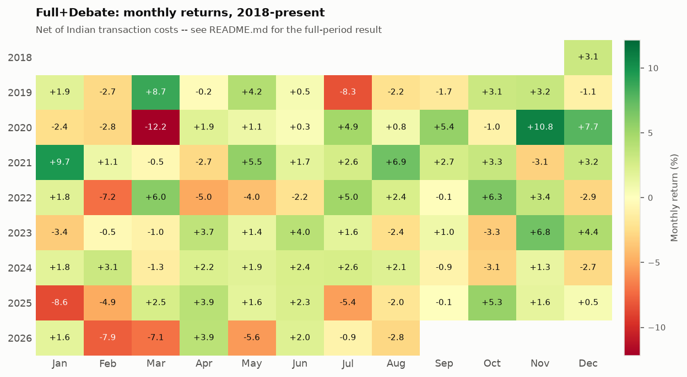

# Strategy Factsheet -- Full+Debate

**This is not a positive track record.** Full+Debate does not beat Buy&Hold net of real Indian transaction costs over this study's 7.6-year out-of-sample window (95% CI on the Sharpe gap includes zero -- see README.md). This factsheet reports the same result in institutional format, not a different or more favourable one.

## Key Metrics

| Metric | Value |
| --- | --- |
| CAGR | +6.91% |
| Sharpe (net, excess) | +0.131 |
| Sortino | +0.186 |
| Calmar | +0.267 |
| Information Ratio (vs Nifty 50) | -0.438 |
| Beta (vs Nifty 50) | 0.641 |
| Max Drawdown | -25.88% |
| Annualised Volatility | 14.63% |
| Hit Rate | 52.1% |
| Trading Days | 1,911 |

## Monthly Return Heatmap (2018-present)

## Benchmark Comparison

| Series | CAGR | Sharpe | MaxDD | Days |
| --- | --- | --- | --- | --- |
| Full+Debate | +6.91% | +0.131 | -25.88% | 1911 |
| Buy&Hold | +16.15% | +0.577 | -38.56% | 1912 |
| Nifty50 | +11.62% | +0.377 | -37.77% | 1904 |
| EqualWeightUniverse | +16.18% | +0.578 | -38.56% | 1912 |
| NiftyNext50 | +15.81% | +0.525 | -36.46% | 1646 |

*Nifty Next 50 starts 2020-01-01 (Yahoo's data floor for that ticker) -- its row covers a shorter window than the others and is not directly comparable in absolute terms.*

## LLM Debate & Sentiment Stats

- **Total decisions**: 19,110
- **Debate escalation rate**: 97.4% of decisions went to the bull/bear debate pass
- **Sentiment label distribution** (34,992 scored headlines):
  - Good: 48.1%
  - Unknown: 37.4%
  - Bad: 14.5%

---
*Generated by `scripts/generate_factsheet.py`. See README.md for the full study, KNOWN_ISSUES.md for what remains unverified, and PREREGISTRATION.md for the pre-registered attempts this result was checked against.*